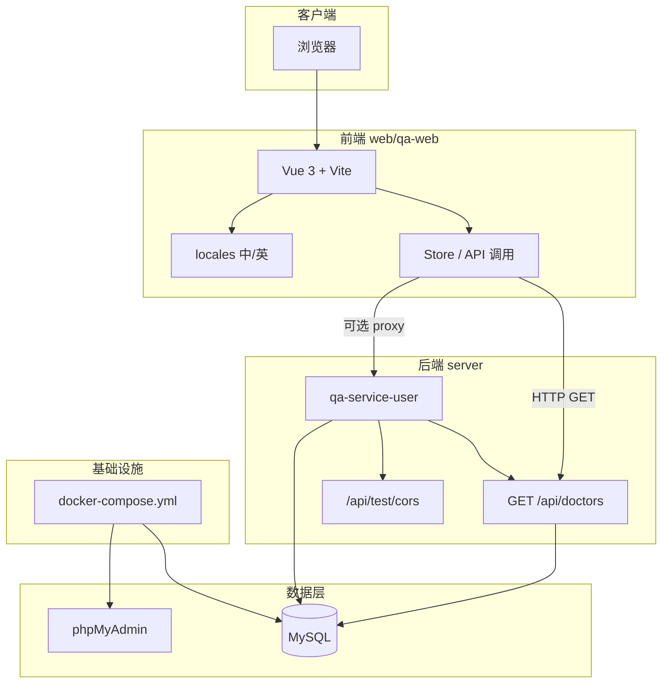
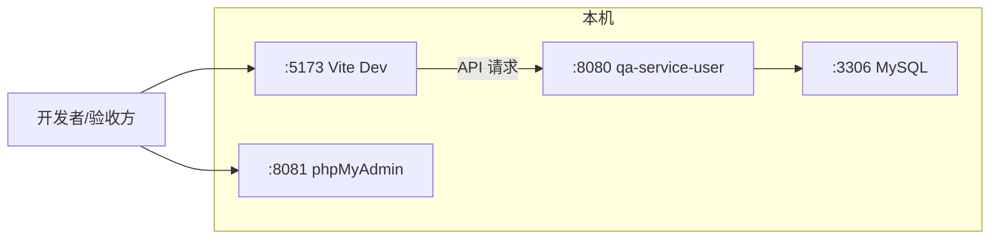
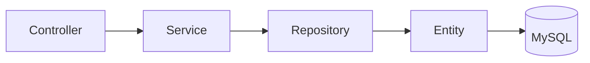
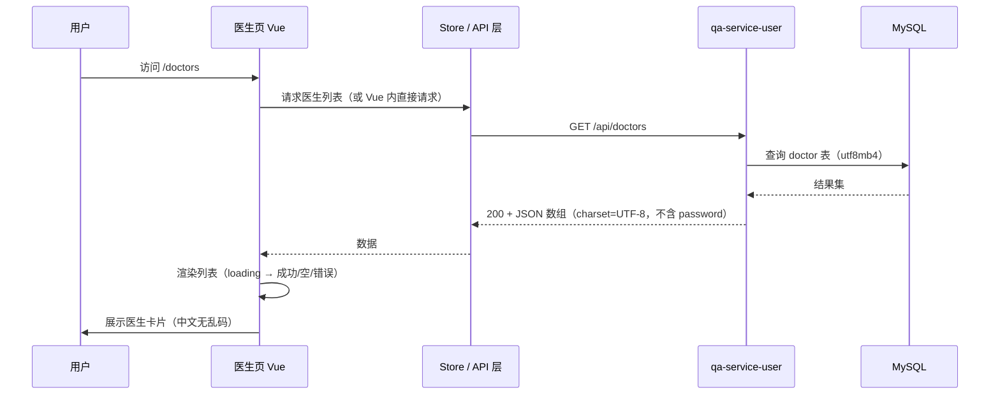
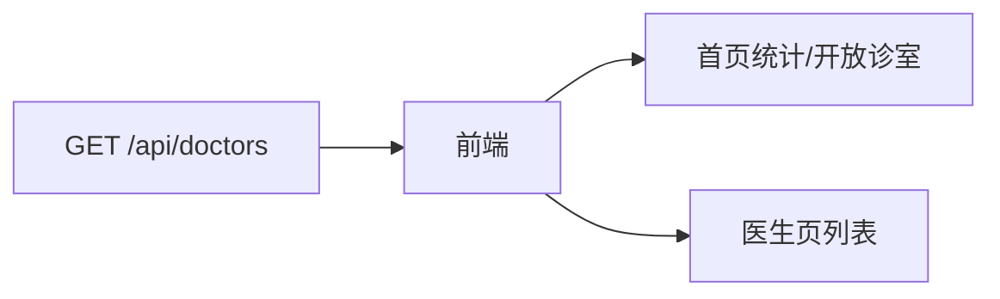

# 技术实现文档

**文档角色**：架构师  
**基于**：README.md、《项目分析与结构说明.md》、《需求分析文档》  
**版本**：2.0  
**目标**：定义系统架构、数据库设计、API 规范与前后端交互流程，覆盖 README 全部技术细节，指导开发实现  

---

## 一、系统架构设计图

### 1.1 本阶段在测范围架构（面试交付范围）



### 1.2 部署与运行拓扑



- **前端**：`web/qa-web`，`npm run dev`，默认端口 **5173**。
- **后端**：`server/qa-service-user`，`./mvnw spring-boot:run`，端口 **8080**。
- **MySQL**：由根目录 **docker-compose.yml** 创建，端口 3306；库名 qa_healthcare，用户 qa_user。
- **phpMyAdmin**：由同一 docker-compose 挂接，常见端口 8081（以 docker-compose.yml 为准）。

**启动顺序**：Docker（MySQL + phpMyAdmin）→ qa-service-user → 前端 `npm run dev`。

### 1.3 后端 qa-service-user 分层结构



- **Controller**：DoctorController（GET /api/doctors）、TestController（/api/test/cors）。
- **Service**：DoctorService，实体转 DTO、specialties JSON 解析，不暴露 password。
- **Repository**：DoctorRepository，JpaRepository<Doctor, String>。
- **Entity**：Doctor，@Table(name = "doctor")，与《项目分析与结构说明》中缺失项补全后一致。
- **Config**：CorsConfig、Utf8EncodingConfig（含 server.servlet.encoding.charset=UTF-8），保证 API 响应 UTF-8，避免中文乱码。

---

## 二、数据库设计（ER 图）

### 2.1 本阶段涉及的实体（仅医生）

当前需求仅将**医生**数据迁至 MySQL，患者、问题等仍可保留在前端 JSON。ER 仅描述医生实体与表结构。

```mermaid
erDiagram
    doctor {
        string id PK "业务主键，如 doc001"
        string username UK "登录名，唯一"
        string password "密文存储，API 不返回"
        string name "显示姓名"
        string title "职称"
        string department "科室"
        string avatar "头像 URL"
        string experience "经验描述"
        string specialties "JSON 数组序列化，如 [\"高血压\",\"冠心病\"]"
        boolean is_active "是否在线"
        datetime created_at "创建时间，可选"
        datetime updated_at "更新时间，可选"
    }
```

### 2.2 表结构规范（MySQL）

| 字段名 | 类型 | 约束 | 说明 |
|--------|------|------|------|
| id | VARCHAR(32) | PRIMARY KEY | 业务主键，与现有 JSON 的 id 一致（如 doc001） |
| username | VARCHAR(64) | NOT NULL, UNIQUE | 登录名 |
| password | VARCHAR(255) | NOT NULL | 密码（API 响应中不返回） |
| name | VARCHAR(128) | NOT NULL | 显示姓名 |
| title | VARCHAR(64) | | 职称 |
| department | VARCHAR(64) | | 科室 |
| avatar | VARCHAR(512) | | 头像 URL |
| experience | VARCHAR(128) | | 经验描述 |
| specialties | JSON 或 VARCHAR(512) | | 专长列表，JSON 数组（如 ["高血压","冠心病"]） |
| is_active | TINYINT(1) / BOOLEAN | DEFAULT 1 | 是否在线 |
| created_at | DATETIME | | 可选 |
| updated_at | DATETIME | | 可选 |

- **表名**：**必须为小写** `doctor`，全库仅此一张医生表。实现时使用 `@Table(name = "doctor")`，并配置 `PhysicalNamingStrategyStandardImpl`，避免出现 doctor 与 Doctor 两张表。
- **字符集**：表与库使用 **utf8mb4**，避免中文乱码；见本节表结构规范及字符集约定。【评审意见】《数据库说明》当前在 docs 下不存在，此处改为引用本节。
- **初始数据**：由 `data.sql` 在应用启动时向表 `doctor` 插入至少 5 条与原有 `doctor-user-list.json` 等效的记录。

---

## 三、API 接口设计规范

### 3.1 通用规范

| 项目 | 约定 |
|------|------|
| 基础路径 | 无统一前缀；REST 资源在 `/api` 下。 |
| 数据格式 | 请求/响应均为 JSON；Content-Type: application/json。 |
| **字符集** | **UTF-8**；医生列表等含中文的接口响应头建议为 `Content-Type: application/json;charset=UTF-8`，避免前端中文乱码。 |
| 错误响应 | HTTP 状态码 + 可选 JSON body（如 message、code）；本阶段至少保证 200/500 可区分。 |
| 安全 | 列表接口不返回 password 等敏感字段。 |

### 3.2 医生列表 API（本阶段核心）

**接口名称**：获取医生列表（支持前端 [Doctors.vue](web/qa-web/src/views/Doctors.vue) 显示医生列表）

| 项目 | 说明 |
|------|------|
| 方法 | GET |
| 路径 | `/api/doctors` |
| 请求参数 | 无 |
| 请求体 | 无 |

**响应**

| 项目 | 说明 |
|------|------|
| 状态码 | 200 OK |
| Content-Type | application/json;**charset=UTF-8**（避免中文乱码） |
| 响应体 | JSON 数组，每项为医生对象。 |

**医生对象字段（与 Doctors.vue 一致）**

| 字段 | 类型 | 必填 | 说明 |
|------|------|------|------|
| id | string | 是 | 主键 |
| username | string | 是 | 登录名 |
| name | string | 是 | 显示姓名 |
| title | string | 是 | 职称 |
| department | string | 是 | 科室 |
| avatar | string | 是 | 头像 URL |
| experience | string | 是 | 经验描述 |
| specialties | string[] | 是 | 专长列表 |
| isActive | boolean | 是 | 是否在线（驼峰命名，与前端一致） |

**禁止返回**：`password`。

**示例响应**

```json
[
  {
    "id": "doc001",
    "username": "dr-zhang-wei",
    "name": "张伟医生",
    "title": "主任医师",
    "department": "心内科",
    "avatar": "https://images.pexels.com/photos/5215024/pexels-photo-5215024.jpeg?auto=compress&cs=tinysrgb&w=400",
    "experience": "15年临床经验",
    "specialties": ["高血压", "冠心病", "心律失常"],
    "isActive": true
  }
]
```

### 3.3 已有接口（需在 docs/api.md 中一并说明）

【评审意见】凡 qa-service-user 对外暴露的 HTTP API，均应在 docs/api.md 中登记并含测试说明或引用 API_TEST.md，以便满足 README「全部 API」说明要求并便于后续维护。

| 方法 | 路径 | 说明 |
|------|------|------|
| GET | /api/test/cors | CORS 测试，返回 message、timestamp、service 等。 |
| POST | /api/test/cors | CORS POST 测试，可带 body。 |
| OPTIONS | /api/test/cors | 预检请求。 |

---

## 四、前后端交互流程

### 4.1 医生列表加载流程



### 4.2 首页统计与开放诊室数据流

首页的「专业医生」总数、开放诊室列表等需与医生数据一致：

- **推荐**：首页同样调用 **GET /api/doctors**，在前端计算 totalDoctors、开放诊室列表（isActive 为 true 的医生）。
- 可选：后端额外提供统计接口；本阶段为简化实现，推荐上述方式。



### 4.3 首页中英文切换与展示范围

- **语言切换控件**：**仅在首页**（路由 `/`）展示；问诊、医生、关于等页**不展示**，与 README「只需要处理首页本身」一致。
- **数据来源**：语言资源来自 `web/qa-web/src/locales`（如 zh-CN.json、en.json），切换后首页文案动态更新。

### 4.4 前后端联调要点

| 项目 | 说明 |
|------|------|
| **基地址** | 后端默认 `http://localhost:8080`；前端可通过 Vite proxy 将 `/api` 代理到 8080，避免跨域。 |
| **CORS** | 若前端直连 8080，qa-service-user 需配置 CORS，allowed-origins 包含前端地址（如 `http://localhost:5173`）。 |
| **Loading/空/错误** | 医生页请求前显示 loading；200 且空数组显示「暂无医生」；非 2xx 或网络错误显示「加载失败」，不白屏。 |
| **中文乱码** | 后端 API 响应头 `Content-Type: application/json;charset=UTF-8`；数据库表与库 utf8mb4；前端使用 UTF-8 页面编码；见《测试验收文档》F3.8。 |
| **启动顺序** | Docker → qa-service-user → 前端。 |
| **医生表唯一性** | 库中仅一张小写表 `doctor`，若有双表见本文档二、数据库设计及相关说明排查。【评审意见】《数据库说明》当前不存在，统一引用本文档。 |

---

*本文档与《需求分析文档》《测试验收文档》《项目分析与结构说明》配套使用（若单独成册则《数据库说明》）；实现时以 README 与需求分析文档为最终依据。【评审意见】《数据库说明》当前未单独存在，配套列表已调整。*
